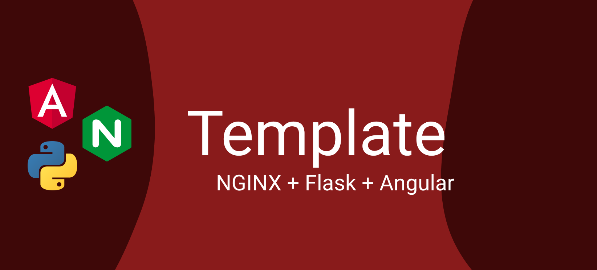
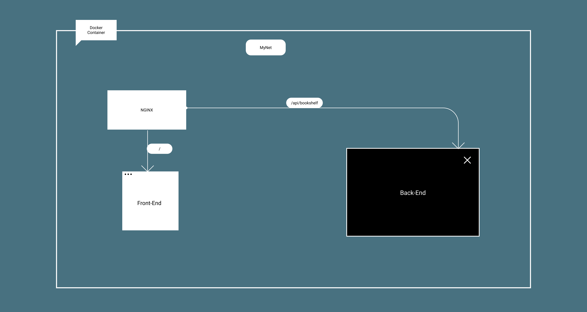

# NGINX + Flask + Angular
> Architecture specification



## Prerequisites:

* Docker: https://docs.docker.com/install/
* Docker compose: https://docs.docker.com/compose/install/
* Angular CLI: https://cli.angular.io
* Firebase: https://firebase.google.com
* Python: https://www.python.org
* Pip: https://pypi.org/project/pip/
* Redis: https://redis.io/
* Celery: https://docs.celeryproject.org/en/stable/getting-started/introduction.html

## Quick setup
1. Download Docker and Docker compose
2. Run ```docker-compose up --build```
3. Navigate to *http://localhost*


## Architecture:



* **Docker:** Container management for the architecture.
* **Backend:** Flask server with Redis & Celery for background processing.
* **Frontend:** Angular web app with control over POST notifications + Firebase integration.

## Walkthrough

* **Swagger**: A [Swagger specification](https://app.swaggerhub.com/apis/lucferbux/yvh_api/1.0.0) is live in this url, you can check the communication described bellow  **TODO: CHANGE**

* **Blog** TODO

## Debug
* Change URL in both frontend and backend

### Backend
* Run bootstrap.sh

### Frontend
* If it is the first time, run ```npm install```
* Run ```ng serve```
* You must change **url.ts** to point to the backend


## Deploy

### With Script

#### Run the script
Just run the following (if command sed fails, change to unix format, is in BSD/macOS format):
* **Example**: bash deploy.sh -u 11.11.11.1111 -s http
* scp ./SeedtagDeploy.zip deploy_host.sh root@11.11.11.1111:/usr/src
* docker-compose up --build


### Without script

#### Compile angular app
* Change the URL in frontend/src/app/url.ts
* cd frontend
* npm run build

#### Check certificate
* Change the name of the server in ngix.conf

#### Zip and sent
* Zip project
* scp ./SeedtagDeploy.zip deploy_host.sh username@destination.com:/usr/src

#### In server 

* docker kill $(docker ps -q)
* cd /usr/src
* rm -r ./SeedtagDeploy*
* unzip SeedtagDeploy.zip
* cd SeedtagDeploy
* docker-compose -f docker-compose.yml up --build


### Attach shell
* docker exec -it [DOCKERID] bash


## Author

* Lucas Fernández Aragón [@lucferbux](https://twitter.com/lucferbux)
